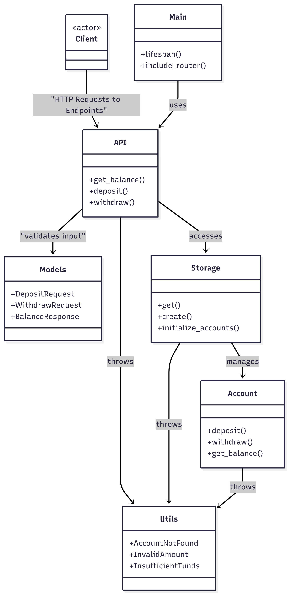
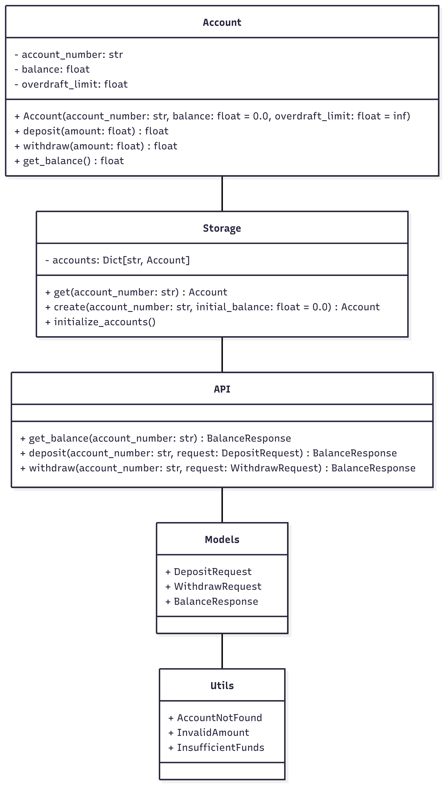

# Mini-ATM Server - Project Documentation

## 1\. Deployment

**Source code**

*   All source code and configuration files for the Mini-ATM project are available at the [link](https://github.com/167daniel/ATM).

**Live Demo**

*   The API is currently deployed and accessible at:

      https://atm-reuo.onrender.com

You can explore and interact with the API through its automatic documentation available at:
           [https://atm-reuo.onrender.com/docs](url)

#
## 2\. Project Specification

**Objective:** Implement a minimal banking server that allows depositing and withdrawing funds from user accounts via a RESTful API.

**Functional Requirements:**

*   Retrieve account balance by ID.
*   Deposit a positive amount to an account.
*   Withdraw a positive amount from an account.

**Expected Data Fields:**

| Field Name | Type | Description |
| --- | --- | --- |
| account_number | str | Unique identifier of the account. |
| Amount | float | Positive number representing amount to deposit/withdraw. |

**Required HTTP Requests:**

| Method | Endpoint | Description |
| --- | --- | --- |
| GET | /accounts/{account_number}/balance | Retrieve account balance |
| POST | /accounts/{account_number}/deposit | Deposit a positive amount |
| POST | /accounts/{account_number}/withdraw | Withdraw a positive amount |

**Constraints:**

*   No persistent storage required (in-memory only).
*   No authentication required.

**Out of Scope:**

*   Account creation/deletion.
*   Overdraft enforcement.
*   Transaction history.
*   Different Currencies.
*   Client side.

## 3\. Glossary

*   **Account** – A digital entity holding a balance and supporting operations.
*   **Deposit/Withdraw** – Adding/removing funds to/from the balance.
*   **FastAPI** – Python web framework used to build the REST API.
*   **Pydantic** – Validation tool used to parse and enforce request schema.

## 4\. Assumptions

*   There is no need for user authentication or session tracking.
*   Fractional amounts are allowed (e.g., 10.25 USD).
*   Account numbers are unique and string based.
*   Logging is minimal, requiring only account number.
*   Invalid or malformed requests will return appropriate HTTP codes via FastAPI.
*   There is only one currency.
*   Overdraft is allowed, meaning an account balance **can** be negative.
*   Concurrency issues are avoided due to low request volume, Global Interpreter Lock in Python and the simplicity of operations (in production environment it’s best to use locks).

## 5\. Product Requirements & User Stories

**product Vision**

*   Build a simple and reliable REST API that enables basic banking operations: retrieving balance, depositing, and withdrawing funds. achieved by using in-memory storage and minimalistic architecture, optimized for future extensibility and educational clarity.

**Target users**

*   This system is designed for everyday banking clients who want to:
    *   Check their account balance.
    *   Deposit or withdraw money quickly and securely.
    *   Interact with a minimal interface or be served through automated banking systems (e.g., ATMs).
*   The user base is not segmented by technical role but rather includes:  
    \- Individuals managing personal finances.  
    \- Customers using ATM systems.  
    \- Users expecting simple and quick banking API responses.

**high-Level Product Requirements**

| ID | Requirement | Priority |
| --- | --- | --- |
| PR1 | Users must be able to retrieve the balance of a specific account | High |
| PR2 | Users must be able to deposit funds into an account | High |
| PR3 | Users must be able to withdraw funds from an account | High |
| PR4 | All operations must be validated for correct input | High |
| PR5 | All data should be kept in-memory | High |
| PR6 | Logging must track key events and errors (for debugging) | Low |
| PR7 | Future extension placeholders should be allowed in the design | Low |

**User Stories**

| ID | User Story | Acceptance Criteria |
| --- | --- | --- |
| US1 | As a user, I want to check my balance, so I know how much money I have | GET /accounts/{id}/balance returns account balance or 404 if not found |
| US2 | As a user, I want to deposit a positive amount to my account | POST /accounts/{id}/deposit with valid amount updates balance |
| US3 | As a user, I want to withdraw a positive amount, even if it causes an overdraft | POST /accounts/{id}/withdraw succeeds unless input is invalid or account missing |
| US4 | As a user, I want the server to handle simultaneous requests without errors | Concurrent deposits/withdrawals should not corrupt state |
| US5 | As a user, I want clear errors if I enter incorrect input | Invalid input returns 400/422 with descriptive error messages |

**initial MVP Scope:**

*   In-memory storage (no persistence).
*   Three endpoints:
    *   **GET** /accounts/{id}/balance
    *   **POST** /accounts/{id}/deposit
    *   **POST** /accounts/{id}/withdraw
*   Error handling for:
    *   Missing account (404).
    *   Validation errors (422).

## 6\.  Design Overview

The solution uses FastAPI to expose RESTful endpoints and an in-memory dictionary to simulate a data store. Business logic is encapsulated in a dedicated Account class. Each module handles a distinct concern to promote modularity and extensibility.

**Design goals**

*   Stay minimal to match the spec.
*   Ensure extensibility for future features.
*   Provide basic error handling even if not explicitly required, for debugging purposes.

**Technology Choice Justification**

*   In-Memory Dictionary for Storage

global Python dictionary was selected to store account data because it offers constant-time (O(1)) lookup performance. This makes it ideal for a simulation of ATM-like operations where speed and responsiveness are critical.

In this simulation, concurrent requests are tested using threads, while due to the Global Interpreter Lock in Python and the simplicity of operations, issues like race conditions are naturally avoided.

In a production system with heavy loads, to safely handle concurrent reads and writes to shared memory structures (which are not in-memory), there will be a need to use one of the following:

*   **Thread locks** to wrap critical sections.
*   **Async-safe data stores**.
*   **Atomic operations** provided by concurrent or multiprocessing libraries

Advantages:

*   **Performance**: Dictionary lookups by key are extremely fast and efficient.
*   **Simplicity**: Using a built-in data structure avoids setup complexity and third-party dependencies.
*   **Transparency**: Easy to inspect, test, and reset during development and simulation.
*   FastAPI

FastAPI was selected as the web framework due to its modern design, ease of use, and performance benefits:

*   **Asynchronous Support**: Built-in async handling allows for scalable I/O operations — ideal for simulating concurrent ATM requests.
*   **Speed**: FastAPI is one of the fastest Python frameworks.
*   **Developer Experience**: interactive docs simplify testing and client integration.
*   **Modularity**: Enables clean separation of concerns (routes, business logic, models, etc.).
*   Pydantic

Pydantic was chosen for data validation and serialization due to its:

*   **Automatic Type Validation**: Ensures request/response data integrity without manual checks.
*   **Ease of Use**: Simple class-based schema definitions.
*   **Integration with FastAPI**: Natively supported for seamless model binding and request parsing.
*   **Descriptive Errors**: Generates detailed and structured error messages useful for debugging and client handling.

These choices align with modern Python backend best practices and support future extensibility.

**Modules Overview**

| Module | File Name | Description | Key Responsibilities | Key Dependencies |
| --- | --- | --- | --- | --- |
| Main App Entrypoint | main.py | Starts FastAPI app, includes router, handles app lifecycle | App initialization, router inclusion, lifespan events | FastAPI, api, storage |
| Routing Layer | api.py | Defines all API endpoints for balance, deposit, withdrawal | Request validation, response formatting, exception handling | FastAPI, models, storage, utils |
| Business Logic | account.py | Defines Account class with methods to deposit, withdraw, and check balance | Domain model logic and balance computation | utils |
| In-Memory Store | storage.py | Manages account storage using a global accounts dictionary | lookup and create accounts | account, utils |
| Data Models | models.py | Pydantic schemas for request/response (e.g., DepositRequest, BalanceResponse) | Type validation, constraints enforcement | Pydantic |
| Exceptions | utils.py | Defines custom exceptions used in API and logic (e.g., AccountNotFound, InvalidAmount) | Custom error types mapped to HTTP responses | None |

## 7\.  Architecture UML

**High-level UML**

**In-Depth UML**

## 8\. API Specification

| Method | Endpoint | Request Body | Success Response | Error Response Code |
| --- | --- | --- | --- | --- |
| GET | /accounts/{account_number}/balance | None | {account_number, balance} | 404 |
| POST | /accounts/{account_number}/deposit | {amount: float} | {Updated balance} | 404 or 422 |
| POST | /accounts/{account_number}/withdraw | {amount: float} | {Updated balance} | 404 or 422 |

## 

## 9\. HTTP Response Summary

| Status Code | Meaning | When Used |
| --- | --- | --- |
| 200 | OK | Operation succeeded |
| 400 | Bad Request | Business logic validation error (e.g., invalid amount) |
| 404 | Not Found | Account does not exist |
| 405 | Method Not Allowed | Invalid HTTP verb on endpoint |
| 422 | Unprocessable Entity | Body missing fields or malformed |

## 10\. Client-Server Sequence Diagram

## 11\. Challenges met in project

**Ensuring Type Safety and Input Validation**

*   **Challenge**: Preventing invalid or malformed input from reaching the business logic (e.g., negative deposit amounts).
*   **Solution**: leveraged **Pydantic** models to strictly enforce constraints such as amount > 0 and automatically generate error messages when validation fails.

**Simulating Concurrent Access to Memory**

*   **Challenge**: Simulating multiple users interacting with the system simultaneously, without introducing race conditions.
*   **Solution**: Built a test script (concurrent\_clients.py) using ThreadPoolExecutor to run operations in parallel, mimicking real-world concurrency. While Python’s GIL reduces risk, I acknowledged the limitations and planned for lock-based improvements in future versions.

**Error Handling and HTTP Status Mapping**

*   **Challenge**: Aligning custom exceptions (AccountNotFound, InvalidAmount) with HTTP status codes like 404 or 400.
*   **Solution**: A centralized exception-to-HTTP mapping in the API routes using try/except blocks, with detailed logging to trace failures.

**Planning for Future Extensibility**

*   **Challenge**: Designing a minimal system that can support future growth and extensions.
*   **Solution**: All code was designed according to OOP and modularized with several different placeholders (e.g., currency support, overdraft control) and extensible patterns like centralized model handling, exception abstraction, and service separation.

## 12\. Logging

*   Basic logging using Python’s logging module.
*   Logs to console for:
    *   Balance check (INFO).
    *   Deposits/withdrawals (INFO).
    *   Errors like invalid amounts/account not found (WARNING).

## 13\. Testing Strategy

*   Although out of scope, Provided Is a module for testing which has been used for debugging.
*   In the interest of allowing testing, on Startup the Server initializes two accounts named: “0” and “1”, each with a positive balance of 1,000.
*   **Concurrent Client Simulation**: 2 clients executing actions in parallel using ThreadPoolExecutor
*   **Edge Cases Covered**:
    *   Withdraw > balance (allowed).
    *   Withdraw/deposit zero or negative amounts.
    *   Malformed/missing JSON.
    *   Invalid HTTP method.
    *   Non-existent account.

## 14\. Dependencies

**Key Dependencies:**

*   fastapi
*   uvicorn
*   pydantic

## 

## 15\. API Usage Examples

Get balance  
curl http://localhost:8000/accounts/0/balance  
  
Deposit 100  
curl -X POST http://localhost:8000/accounts/0/deposit -H "Content-Type: application/json" -d '{"amount": 100}'  
  
Withdraw 50  
curl -X POST http://localhost:8000/accounts/0/withdraw -H "Content-Type: application/json" -d '{"amount": 50}'

## 16\. Future Extensions

| Feature | Description | Required Changes |
| --- | --- | --- |
| Authentication | Add user login and security layers | User model, auth middleware, token management |
| Transaction History | Log and retrieve past transactions per account | Extend Account with history list, add /accounts/{id}/history route |
| Persistent Storage | Store account data in a real database | refactor storage.py |
| Overdraft Control | Enforce overdraft limits with exception handling | Add InsufficientFunds exception, update withdraw() logic |
| Currency Support | Allow accounts to operate in different currencies, with conversion options | Add currency to model |
| Monitoring & Logging | Add detailed logs, metrics, and health checks | Integrate logging tools and logging file |
| Max Withdrawal | Avoid large withdrawal (even without exceeding overdraft) | Add patch to account.py |
| Account Management | Creating and deleting accounts | refactor storage.py |
| UUID Support | Use UUIDs instead of simple strings fo raccount identifiers to improve uniqueness and security | Update Account model to accept UUIDs; adjust API and storage to handle UUID type 
